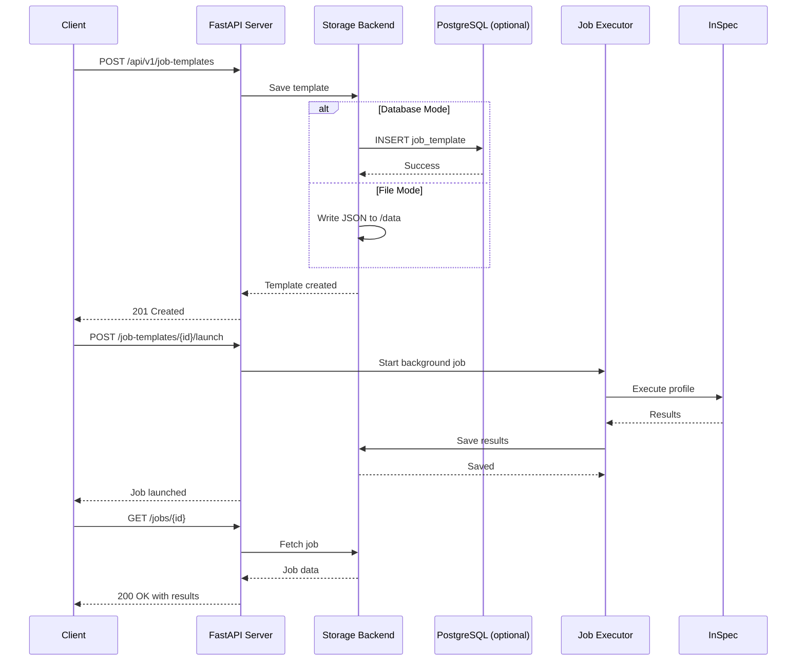
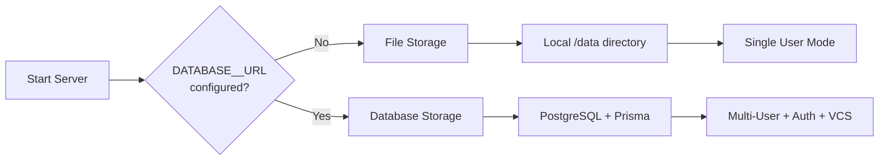
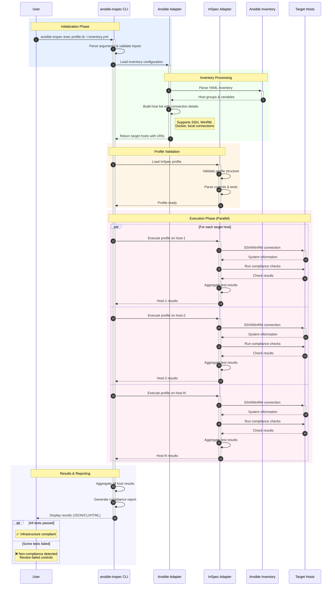

# ansible-inspec

[](https://pypi.org/project/ansible-inspec/)
[](https://pypi.org/project/ansible-inspec/)
[](https://pypi.org/project/ansible-inspec/)
[](https://hub.docker.com/r/htunnthuthu/ansible-inspec)
[](https://hub.docker.com/r/htunnthuthu/ansible-inspec)
[](LICENSE)

---
A compliance and infrastructure testing tool that **converts InSpec profiles to native Ansible collections**, enabling compliance testing through pure Ansible without requiring InSpec on target systems.

## Overview

`ansible-inspec` bridges two powerful open-source projects:
- **[Ansible](https://github.com/ansible/ansible)**: IT automation platform for configuration management
- **[InSpec](https://github.com/inspec/inspec)**: Compliance testing framework (used for conversion only)


## Why Ansible-InSpec?

### 🎯 The Perfect Bridge

Ansible-InSpec provides **true InSpec-to-Ansible migration**, giving you:

#### 🔐 **Enterprise Security**
- **🔑 Azure AD OAuth2**: Enterprise SSO with role-based access control
- **🔒 Encrypted Credentials**: Fernet symmetric encryption for VCS credentials
- **👥 Multi-User Support**: User authentication and authorization with local accounts
- **📊 Audit Logging**: Track who performed what actions
- **🔐 Session Persistence**: 7-day token expiry with automatic session restoration
- **🍪 Secure Cookies**: HTTP-only cookies with configurable security settings

#### 💾 **Production-Ready Storage**
- **🗄️ PostgreSQL Database**: Scalable database backend with connection pooling
- **🔄 Hybrid Storage**: Dual-write validation mode for safe migration
- **📈 Monitoring**: Prometheus metrics for storage operations
- **🔁 Automatic Cutover**: Validated transition from file to database storage

#### 🔄 **Version Control Integration**
- **📦 Git Repository Sync**: Automatic sync of InSpec profiles from GitHub/GitLab
- **⏱️ Polling & Webhooks**: Both periodic polling and event-driven sync
- **🔐 Secure Credentials**: Encrypted SSH keys and tokens
- **🚀 Auto-Import**: Automatically create job templates from synced profiles

#### 🌐 **Web UI & REST API (v0.3.0)**
- **📊 Streamlit Dashboard**: Modern web interface for job management
- **🔌 FastAPI Server**: RESTful API for automation and integration
- **📋 Job Templates**: Reusable compliance check configurations
- **🚀 Background Execution**: Non-blocking job execution with status tracking
- **🔄 Workflow Management**: Chain multiple compliance checks together
- **📚 Auto-generated API Docs**: Swagger UI and ReDoc documentation

#### ✅ **No InSpec Dependency (v0.2.0)**
- **Native Translation**: Converts InSpec resources to Ansible modules
- **No Target Installation**: InSpec NOT required on target systems
- **Only PowerShell**: Windows targets need only built-in PowerShell
- **True Migration**: Actually migrate FROM InSpec TO Ansible ecosystem

#### 🚀 **Supported Resource Translation**
v0.2.0+ translates these InSpec resources to **native Ansible**:
- `security_policy` → `ansible.windows.win_security_policy`
- `registry_key` → `ansible.windows.win_reg_stat`
- `audit_policy` → `ansible.windows.win_shell` (auditpol)
- `service` → `ansible.windows.win_service_info`
- `windows_feature` → `ansible.windows.win_feature`
- `file` → `ansible.windows.win_stat` / `ansible.builtin.stat`

**More resources coming in future releases!**

#### ✅ **Unified Workflow**
- **Single Tool, Two Powers**: Combine Ansible's automation with InSpec's compliance DSL
- **Same Inventory**: Use your existing Ansible inventory for compliance testing
- **Consistent Access**: Leverage Ansible's SSH/WinRM/Docker connections
- **No Duplicate Configuration**: Manage infrastructure and compliance from one place

#### 🚀 **Accelerated Compliance**
- **Parallel Testing**: Run compliance checks across hundreds of hosts simultaneously
- **Fast Feedback**: Get immediate compliance results after infrastructure changes
- **Continuous Compliance**: Integrate into CI/CD pipelines for automated validation
- **Shift-Left Security**: Test compliance before production deployment

#### 🔒 **Enhanced Security & Governance**
- **CIS Benchmarks**: Convert CIS benchmark profiles to Ansible
- **Custom Policies**: Define organization-specific compliance requirements
- **Audit Ready**: Generate compliance reports for auditors and stakeholders
- **Drift Detection**: Identify configuration drift from security baselines

#### 💡 **Developer Friendly**
- **Readable DSL**: InSpec's human-readable language for compliance
- **Version Control**: Store compliance tests alongside infrastructure code
- **Test-Driven Infrastructure**: Build infrastructure with compliance tests first
- **Reusable Profiles**: Share compliance tests across teams and projects

#### 🌐 **Multi-Platform Excellence**
- **Windows**: Windows Server and Desktop (native module support)
- **Linux**: All major distributions (Ubuntu, RHEL, CentOS, Debian, etc.)
- **Containers**: Docker and Kubernetes
- **Cloud**: AWS, Azure, GCP resources (coming soon)

#### 📊 **Comprehensive Reporting**
- **Multiple Formats**: JSON, HTML, JUnit, CLI output
- **Detailed Results**: See exactly what passed/failed and why
- **Trend Analysis**: Track compliance over time
- **Integration Ready**: Feed results into your monitoring/reporting systems

#### 💰 **Cost Effective**
- **Open Source**: Free, GPL-3.0 licensed
- **No Agent Required**: Agentless compliance testing
- **Reduced Dependencies**: No InSpec installation on targets (v0.2.0+)
- **Lower Training**: Leverage existing Ansible knowledge

### 🆚 Compared to Alternatives

| Feature | Ansible-InSpec v0.2.0 | Pure InSpec | Pure Ansible | Other Tools |
|---------|----------------------|-------------|--------------|-------------|
| Target Dependency | ✅ None (PowerShell only) | ❌ InSpec + Ruby | ✅ None | ⚠️ Varies |
| Native Conversion | ✅ Yes | ❌ N/A | ⚠️ Manual | ❌ No |
| Ansible Inventory | ✅ Native | ❌ Manual | ✅ Native | ❌ Separate |
| Compliance DSL | ✅ InSpec | ✅ InSpec | ⚠️ Tasks | ⚠️ Varies |
| Multi-Platform | ✅ Excellent | ✅ Excellent | ✅ Good | ⚠️ Limited |
| Parallel Execution | ✅ Yes | ⚠️ Limited | ✅ Yes | ⚠️ Varies |
| InSpec Migration | ✅ **True Migration** | ❌ N/A | ❌ Manual Rewrite | ❌ No |
| Open Source | ✅ Yes | ✅ Yes | ✅ Yes | ⚠️ Varies |

## Features

### 🌐 Server Features

- **🔐 Enterprise Security**
  - Azure AD OAuth2 authentication with SSO
  - Local user authentication with secure password hashing
  - 7-day session persistence with automatic token restoration
  - Role-based access control (RBAC)
  - Fernet encrypted credential storage
  - Multi-user support with audit logging
  - HTTP-only cookies with configurable security settings
  
- **💾 Production Database**
  - PostgreSQL backend with connection pooling
  - Prisma ORM for type-safe database operations
  - Hybrid storage mode for safe migration
  - Prometheus metrics for monitoring
  
- **🔄 VCS Integration**
  - Automatic Git repository sync (GitHub/GitLab)
  - Polling and webhook support
  - Encrypted SSH keys and tokens
  - Auto-import of InSpec profiles
  
- **📊 Web UI & REST API**
  - Modern FastAPI server with async operations
  - Auto-generated API documentation (Swagger/ReDoc)
  - Job templates for reusable compliance checks
  - Background job execution with real-time status
  - Workflow orchestration for complex scenarios
  - Health checks and Prometheus metrics

### 🔧 CLI Features

- **Profile Conversion**: Convert Ruby-based InSpec profiles to Ansible collections with full custom resource support
- **Chef Supermarket Integration**: Access 100+ pre-built compliance profiles from Chef Supermarket (CIS benchmarks, DevSec baselines, DISA STIGs)
- **Infrastructure as Code Testing**: Test your infrastructure configurations using InSpec's DSL
- **Ansible Integration**: Leverage Ansible's inventory and connection mechanisms
- **Compliance Validation**: Validate security and compliance requirements across your infrastructure
- **Multi-Platform Support**: Test Linux, Windows, macOS, and cloud platforms
- **Human-Readable Tests**: Write tests in a clear, understandable language
- **Multi-Format Reporting**: Generate compliance reports in JSON, HTML, JUnit formats
- **InSpec-Free Mode**: Run converted profiles without InSpec installation

## Architecture

### Server Request Flow



### Storage Modes



## Quick Start

### Installation

```bash
# Install with server features (recommended for production)
pip install ansible-inspec

# Or install CLI-only mode
pip install ansible-inspec --no-deps

# Or from source with all features
git clone https://github.com/Htunn/ansible-inspec.git
cd ansible-inspec
pip install -e ".[server]"  # With server dependencies
# OR
pip install -e .             # CLI only
```

### Server Setup

The server can run in two modes:

#### Quick Start (File Storage - No Database Required)

Perfect for local development, testing, and single-user scenarios:

```bash
# Start server immediately - no database needed!
ansible-inspec start-server

# Access endpoints:
# - REST API: http://localhost:8080
# - API Docs: http://localhost:8080/docs
```

**What you get:**
- ✅ Job templates and execution
- ✅ Profile management  
- ✅ JSON storage in `/data` directory
- ❌ No auth/multi-user (use database mode for this)

#### Production Setup (Database Storage)

For enterprise features with PostgreSQL:

```bash
# 1. Start PostgreSQL (Docker recommended)
docker run -d --name ansible-inspec-postgres \
  -e POSTGRES_USER=ansible \
  -e POSTGRES_PASSWORD=ansible \
  -e POSTGRES_DB=ansible_inspec \
  -p 5432:5432 postgres:16-alpine

# 2. Configure environment
cp .env.example .env
# Edit .env and configure:
# - DATABASE__URL (required)
# - ENCRYPTION_KEY (generate with: python -c "from cryptography.fernet import Fernet; print(Fernet.generate_key().decode())")
# - AUTH__JWT_SECRET (for Azure AD)
# - AUTH__ENABLED=true (optional)
# - VCS__ENABLED=true (optional)

# 3. Initialize database
python scripts/init_prisma.py

# 4. Start the server
ansible-inspec start-server

# 5. Verify
curl http://localhost:8080/health
curl http://localhost:8080/docs  # API documentation
```

**Server endpoints:**
- **📊 REST API**: http://localhost:8080
- **📚 API Docs (Swagger)**: http://localhost:8080/docs
- **📖 API Docs (ReDoc)**: http://localhost:8080/redoc
- **📈 Metrics**: http://localhost:8080/metrics

See [Server Documentation](docs/SERVER.md) and [Quick Start Guide](QUICKSTART.md) for detailed setup.

### Docker Deployment

```bash
# Using Docker Compose (recommended)
git clone https://github.com/Htunn/ansible-inspec.git
cd ansible-inspec

# Copy and configure environment
cp .env.docker .env
# Edit .env and set POSTGRES_PASSWORD, ENCRYPTION_KEY, etc.

# Start services
docker-compose up -d

# Initialize database
docker-compose exec api prisma db push

# Verify
curl http://localhost:8080/health
```

See [Docker Deployment Guide](docs/DOCKER-DEPLOYMENT.md) for production configurations.

### Command Line Usage (CLI)

```bash
# Execute a profile from Chef Supermarket
ansible-inspec exec dev-sec/linux-baseline --supermarket -i inventory.yml

# Run a local profile
ansible-inspec exec ./my-profile -i inventory.yml

# Convert InSpec profile to Ansible collection
ansible-inspec convert ./my-profile -o ./collections
```

### From Docker Hub

```bash
# Pull the latest image
docker pull htunnthuthu/ansible-inspec:latest

# Run with help
docker run --rm htunnthuthu/ansible-inspec:latest --help
```

See [Docker Usage Guide](docs/DOCKER.md) for detailed Docker instructions.

## Documentation

### Server & API
- **[Server Documentation](docs/SERVER.md)** - REST API server guide with enterprise features
- **[Quick Start Guide](QUICKSTART.md)** - Get running in 5 minutes
- **[Docker Deployment](docs/DOCKER-DEPLOYMENT.md)** - Production deployment guide

### CLI & Usage
- **[API Documentation](docs/API.md)** - Complete Python API and CLI reference
- **[Quick Reference](docs/QUICK-REFERENCE.md)** - Common commands and workflows
- **[Docker Usage](docs/DOCKER.md)** - Docker-specific usage and examples
- **[Profile Conversion](docs/PROFILE-CONVERSION.md)** - Converting InSpec profiles to Ansible
- **[Reporter Modes](docs/REPORTER-MODES.md)** - Native vs InSpec-free reporting
- **[Chef Supermarket](docs/CHEF-SUPERMARKET.md)** - Accessing compliance profiles

### Getting Started
- **[Getting Started Guide](docs/getting-started.md)** - Complete beginner's guide
- **[Testing Guide](TESTING.md)** - Running tests and validation

## Usage

### Server Usage

See [Server Documentation](docs/SERVER.md) for complete server features including:
- Job templates and workflow orchestration
- Azure AD authentication
- VCS integration
- PostgreSQL database operations
- API endpoints and examples

### CLI Usage

### Basic Command

```bash
# Run InSpec profile against Ansible inventory
ansible-inspec exec profile.rb -i inventory.yml

# Run compliance tests on specific hosts
ansible-inspec exec compliance/ --target ssh://user@hostname

# Execute with custom reporter and output
ansible-inspec exec profile.rb -i inventory.yml --reporter json --output report.json

# Multiple reporters
ansible-inspec exec profile.rb -i inventory.yml --reporter "cli json:.compliance-reports/report.json html:.compliance-reports/report.html"
```

### Reporter Options

Generate compliance reports in multiple formats:

```bash
# JSON report (InSpec schema-compatible)
ansible-inspec exec profile/ -i inventory.yml --reporter json -o .compliance-reports/report.json

# HTML report
ansible-inspec exec profile/ -i inventory.yml --reporter html -o .compliance-reports/report.html

# JUnit XML for CI/CD integration
ansible-inspec exec profile/ -i inventory.yml --reporter junit -o .compliance-reports/junit.xml

# Multiple formats simultaneously
ansible-inspec exec profile/ -i inventory.yml \
  --reporter "cli json:.compliance-reports/results.json html:.compliance-reports/results.html"
```

**Supported Formats**:
- `cli` - Human-readable console output (default)
- `json` - InSpec JSON schema format
- `html` - HTML report with summary and details
- `junit` - JUnit XML for Jenkins/GitLab CI
- `yaml` - YAML format output

Reports are saved to `.compliance-reports/` by default, compatible with InSpec tooling including Chef Automate and CI/CD pipelines.

### Chef Supermarket Profiles

Leverage 100+ pre-built compliance profiles from [Chef Supermarket](https://supermarket.chef.io):

```bash
# Run DevSec Linux Baseline against your inventory
ansible-inspec exec dev-sec/linux-baseline --supermarket -i inventory.yml

# Test SSH configuration security
ansible-inspec exec dev-sec/ssh-baseline --supermarket -t ssh://prod-server

# Docker CIS Benchmark compliance
ansible-inspec exec cis-docker-benchmark --supermarket -t docker://container_id

# Web server hardening (Apache, Nginx)
ansible-inspec exec dev-sec/nginx-baseline --supermarket -i web_servers.yml

# Database security (MySQL, PostgreSQL)
ansible-inspec exec dev-sec/postgres-baseline --supermarket -i database.yml
```

**Popular Profiles**:
- `dev-sec/linux-baseline` - OS hardening (56 controls)
- `dev-sec/ssh-baseline` - SSH security (28 controls)
- `cis-docker-benchmark` - CIS Docker 1.3.0 (100+ controls)
- `cis-kubernetes-benchmark` - Kubernetes security
- `dev-sec/apache-baseline` - Apache hardening
- `dev-sec/mysql-baseline` - MySQL/MariaDB security
- `dev-sec/nginx-baseline` - Nginx hardening
- `dev-sec/postgres-baseline` - PostgreSQL security

See [Chef Supermarket Guide](docs/CHEF-SUPERMARKET.md) for complete documentation.

### Profile Conversion

Convert InSpec compliance profiles (Ruby) to Ansible collections:

```bash
# Convert local InSpec profile
ansible-inspec convert examples/profiles/custom-compliance \
  --namespace example \
  --collection-name custom_compliance

# Convert Chef Supermarket profile
ansible-inspec exec dev-sec/linux-baseline --supermarket --download ./profiles
ansible-inspec convert ./profiles/linux-baseline \
  --namespace devsec \
  --collection-name linux_baseline

# Use the converted collection
ansible-galaxy collection install ./collections/ansible_collections/example/custom_compliance/*.tar.gz
ansible-playbook example.custom_compliance.compliance_check -i inventory.yml
```

**Automatic Compliance Reporting**: Converted collections include an auto-enabled callback plugin that generates InSpec-compatible reports in `.compliance-reports/`:

```bash
# Reports are automatically generated when running playbooks
cd collections/ansible_collections/example/custom_compliance
ansible-playbook playbooks/compliance_check.yml -i inventory.yml

# Find reports in .compliance-reports/
ls .compliance-reports/
# 20260108-143022-example.custom_compliance-compliance_check.yml.json
# 20260108-143022-example.custom_compliance-compliance_check.yml.html
```

Configure reporting in `ansible.cfg`:

```ini
[defaults]
callbacks_enabled = compliance_reporter
callback_result_dir = .compliance-reports

[callback_compliance_reporter]
output_format = json  # or html, junit
```

**Conversion Features**:
- **Native Ansible Tasks**: Converts standard InSpec resources (file, service, package) to native Ansible modules for better performance
- **Custom Resource Support**: Preserves custom InSpec resources from `libraries/` directory with InSpec wrapper
- **Full Collection Structure**: Generates complete Ansible Galaxy-ready collection with roles, playbooks, and documentation
- **Automatic Detection**: Identifies and handles custom resources automatically
- **Metadata Preservation**: Maintains profile information, tags, and dependencies in `galaxy.yml`

**Example Use Cases**:
- Convert Chef Supermarket profiles for Ansible-native execution
- Migrate existing InSpec compliance tests to Ansible collections
- Publish compliance collections to Ansible Galaxy
- Integrate InSpec-based compliance into Ansible CI/CD pipelines

See [Profile Conversion Guide](docs/PROFILE-CONVERSION.md) for complete documentation.

### Example Profile

```ruby
# compliance/ssh_config.rb
describe sshd_config do
  its('PermitRootLogin') { should eq 'no' }
  its('PasswordAuthentication') { should eq 'no' }
end

describe package('telnetd') do
  it { should_not be_installed }
end
```

### Ansible Inventory Integration

```yaml
# inventory.yml
all:
  hosts:
    web-01:
      ansible_host: 192.168.1.10
    web-02:
      ansible_host: 192.168.1.11
  vars:
    ansible_user: admin
    inspec_profile: compliance/web-server
```

```bash
ansible-inspec exec -i inventory.yml
```

## Quick Start

1. **Install ansible-inspec**
   ```bash
   pip install ansible-inspec
   ```

2. **Create a compliance profile**
   ```bash
   ansible-inspec init profile my-compliance
   ```

3. **Run tests against your infrastructure**
   ```bash
   ansible-inspec exec my-compliance -i inventory.yml
   ```

## Documentation

- [Getting Started Guide](docs/getting-started.md)
- [Writing Compliance Profiles](docs/profiles.md)
- [Ansible Integration](docs/ansible-integration.md)
- [Command Reference](docs/command-reference.md)

## Project Structure

```
ansible-inspec/
├── bin/
│   └── ansible-inspec          # Main executable
├── lib/
│   ├── ansible_inspec/
│   │   ├── ansible_adapter/    # Ansible integration layer
│   │   ├── inspec_adapter/     # InSpec integration layer
│   │   ├── cli/                # CLI interface
│   │   └── core/               # Core functionality
├── profiles/                   # Example compliance profiles
├── tests/                      # Test suite
├── docs/                       # Documentation
└── examples/                   # Usage examples
```

## How It Works

Ansible-InSpec orchestrates compliance testing by combining Ansible's inventory management with InSpec's testing capabilities:



### Workflow Explanation

1. **Initialization**: User runs `ansible-inspec` with a profile and inventory
2. **Inventory Loading**: Ansible adapter parses the YAML inventory and extracts:
   - Host definitions and groups
   - Connection details (SSH keys, passwords, ports)
   - Variables and host-specific configurations
3. **Profile Validation**: InSpec adapter loads and validates the compliance profile
4. **Parallel Execution**: Tests run simultaneously across all target hosts:
   - Establishes connections using Ansible's connection URIs
   - Executes InSpec controls on each host
   - Collects pass/fail results for each control
5. **Results Aggregation**: Combines results from all hosts into unified report
6. **Output**: Presents compliance status in requested format (JSON, CLI, HTML)

### Connection Flow Details

The tool supports multiple connection types automatically detected from your Ansible inventory:

- **SSH**: `ssh://user@hostname:port` with key or password authentication
- **WinRM**: `winrm://user@hostname:port` for Windows hosts
- **Docker**: `docker://container_id` for containerized targets
- **Local**: `local://` for testing the local system

## Upstream Projects

This project builds upon two excellent open-source projects:

### Ansible
- **Repository**: https://github.com/ansible/ansible
- **License**: GPL-3.0
- **Description**: IT automation platform
- **Website**: https://www.ansible.com

### InSpec
- **Repository**: https://github.com/inspec/inspec
- **License**: Apache-2.0
- **Description**: Compliance and security testing framework
- **Website**: https://www.inspec.io

## Docker Usage

```bash
# Initialize a new InSpec profile
docker run --rm -v $(pwd):/workspace htunnthuthu/ansible-inspec:latest \
  init profile my-compliance-tests

# Run compliance tests with Ansible inventory
docker run --rm \
  -v $(pwd):/workspace \
  -v ~/.ssh:/home/ansibleinspec/.ssh:ro \
  htunnthuthu/ansible-inspec:latest \
  exec /workspace/profiles/cis-benchmark \
  -i /workspace/inventory.yml

# Available tags: latest, v0.1.0, v0.2.0, etc.
docker run --rm htunnthuthu/ansible-inspec:v0.1.0 --version
```

See [Docker Usage Guide](docs/DOCKER.md) for more examples.

## Development

### Quick Start

```bash
# Clone repository
git clone https://github.com/Htunn/ansible-inspec.git
cd ansible-inspec

# Install with dev dependencies
make dev-install

# Run tests
make test

# Format code
make format

# Build package
make build
```

See [QUICKSTART.md](docs/QUICKSTART.md) for detailed development setup.

## Publishing

This project uses automated publishing via GitHub Actions:

1. **PyPI**: Triggered by git tags (e.g., `v0.1.0`)
2. **Docker Hub**: Triggered by git tags, builds multi-arch images

See [Publishing Guide](docs/PUBLISHING.md) for details.

## License

This project is licensed under the **GNU General Public License v3.0 (GPL-3.0)**.

Since this project combines components from:
- Ansible (GPL-3.0 licensed)
- InSpec (Apache-2.0 licensed)

The combined work must be distributed under GPL-3.0, as it is the more restrictive license. The Apache-2.0 license is compatible with GPL-3.0, allowing this combination.

See [LICENSE](LICENSE) for the full license text and [NOTICE](NOTICE) for detailed attribution and license compatibility information.

### Why GPL-3.0?

When combining GPL-licensed code (Ansible) with Apache-2.0 licensed code (InSpec), the GPL license governs the combined work. This ensures:
- Compliance with Ansible's GPL-3.0 licensing requirements
- Proper attribution to both upstream projects
- Legal compatibility between the two licenses
- Protection of user freedoms as intended by both projects

## Contributing

We welcome contributions! Please see [CONTRIBUTING.md](CONTRIBUTING.md) for guidelines.

### Code of Conduct

This project adheres to the codes of conduct from both upstream projects:
- [Ansible Code of Conduct](https://docs.ansible.com/ansible/latest/community/code_of_conduct.html)
- [InSpec Code of Conduct](https://github.com/inspec/inspec/blob/main/CODE_OF_CONDUCT.md)

## Support

- **Issues**: [GitHub Issues](https://github.com/htunn/ansible-inspec/issues)
- **Discussions**: [GitHub Discussions](https://github.com/htunn/ansible-inspec/discussions)
- **Chat**: Join our community chat

## Acknowledgments

Special thanks to:
- The Ansible team and community at Red Hat
- The InSpec team and community at Progress Chef
- All contributors to both upstream projects


## Disclaimer

ansible-inspec is an **independent open-source project** and is not officially affiliated with, endorsed by, or supported by Red Hat, Inc. (Ansible) or Progress Software Corporation (Chef InSpec).

**Trademarks:**
- "Ansible" is a registered trademark of Red Hat, Inc.
- "InSpec" is a trademark of Progress Software Corporation.

This project integrates with and builds upon these technologies under their respective open source licenses:
- **Ansible**: GPL-3.0 License ([https://github.com/ansible/ansible](https://github.com/ansible/ansible))
- **InSpec**: Apache-2.0 License ([https://github.com/inspec/inspec](https://github.com/inspec/inspec))

The use of these names in this project is purely descriptive to indicate compatibility and integration. For official Ansible products and support, visit [Red Hat Ansible](https://www.ansible.com/). For official InSpec products and support, visit [Chef InSpec](https://www.chef.io/products/chef-inspec).

